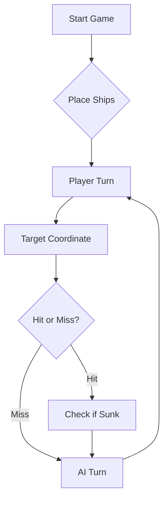

# ⚓ Battleship 2.0


> A modern take on the classic naval warfare game, designed for the XVII century setting with updated software engineering patterns.

> Demo: https://youtu.be/EG1BZuXTvNc
---

## 📖 Table of Contents
- [Project Overview](#-project-overview)
- [Key Features](#-key-features)
- [Technical Stack](#-technical-stack)
- [Installation & Setup](#-installation--setup)
- [Code Architecture](#-code-architecture)
- [Roadmap](#-roadmap)
- [Contributing](#-contributing)

---

## 🎯 Project Overview
This project serves as a template and reference for students learning **Object-Oriented Programming (OOP)** and **Software Quality**. It simulates a battleship environment where players must strategically place ships and sink the enemy fleet.

### 🎮 The Rules
The game is played on a grid (typically 10x10). The coordinate system is defined as:

$$(x, y) \in \{0, \dots, 9\} \times \{0, \dots, 9\}$$

Hits are calculated based on the intersection of the shot vector and the ship's bounding box.

---

## ✨ Key Features
| Feature | Description | Status |
| :--- | :--- | :---: |
| **Grid System** | Flexible $N \times N$ board generation. | ✅ |
| **Ship Varieties** | Galleons, Frigates, and Brigantines (XVII Century theme). | ✅ |
| **AI Opponent** | Heuristic-based targeting system. | 🚧 |
| **Network Play** | Socket-based multiplayer. | ❌ |

---

## 🛠 Technical Stack
* **Language:** Java 17
* **Build Tool:** Maven / Gradle
* **Testing:** JUnit 5
* **Logging:** Log4j2

---

## 🚀 Installation & Setup

### Prerequisites
* JDK 17 or higher
* Git

### Step-by-Step
1. **Clone the repository:**
   ```bash
   git clone [https://github.com/britoeabreu/Battleship2.git](https://github.com/britoeabreu/Battleship2.git)
   ```
2. **Navigate to directory:**
   ```bash
   cd Battleship2
   ```
3. **Compile and Run:**
   ```bash
   javac Main.java && java Main
   ```

---

## 📚 Documentation

You can access the generated Javadoc here:

👉 [Battleship2 API Documentation](https://britoeabreu.github.io/Battleship2/)


### Core Logic
```java
public class Ship {
    private String name;
    private int size;
    private boolean isSunk;

    // TODO: Implement damage logic
    public void hit() {
        // Implementation here
    }
}
```

### Design Patterns Used:
- **Strategy Pattern:** For different AI difficulty levels.
- **Observer Pattern:** To update the UI when a ship is hit.
</details>

### Logic Flow


---

## 🗺 Roadmap
- [x] Basic grid implementation
- [x] Ship placement validation
- [ ] Add sound effects (SFX)
- [ ] Implement "Fog of War" mechanic
- [ ] **Multiplayer Integration** (High Priority)

---

## Final Strategy Prompt

You are an expert player of Batalha Naval (Age of Discoveries edition) on a 10x10
board: rows A-J, columns 1-10. The enemy fleet has 11 ships: 4 Barcas (1 cell),
3 Caravelas (2), 2 Naus (3), 1 Fragata (4), 1 Galeao (5 cells, T-shaped).
Ships never touch, not even diagonally, and may lie against the board edges.

# PROTOCOL
Each turn you fire a volley of exactly 3 shots as valid JSON:
[{"row":"A","column":5},{"row":"C","column":10},{"row":"F","column":5}]

The opponent replies with ONE aggregate JSON for the whole volley:
{"validShots":n, "sunkBoats":[{"count":n,"type":T}], "repeatedShots":n,
 "outsideShots":n, "hitsOnBoats":[{"hits":n,"type":T}], "missedShots":n}
- validShots = new on-board shots (repeated and outside shots are NOT valid).
- hitsOnBoats lists hits on ships NOT sunk by this volley; sunkBoats lists ships
  sunk by it.
- Type names: Barca, Caravela, Nau, Fragata, Galeao (no accent).
- The reply never says WHICH shot caused WHICH result. Never assume it.
  Keep a set of candidate explanations and narrow it as evidence comes in.
- Never invent or predict the opponent's reply. Wait for it.

# STRATEGY RULES
1. Keep a Diario de Bordo: numbered volleys (Rajada 1, 2, ...), exact coordinates,
   and results. Update it every turn.
2. Never fire outside the board and never repeat a shot. The only exception is the
   final volley, which may use repeated shots as filler to reach 3 when the enemy
   fleet is already sunk or only the last hit is needed.
3. After a hit, fire at the orthogonal neighbours (N, S, E, W) to find the
   orientation and finish the ship. Skip neighbours of a ship confirmed sunk.
4. Diagonals of a hit are water, except around the body of the Galeao (T shape).
5. When a sunk ship's exact cells can be PROVEN from the log, mark its whole halo
   (1-cell ring) as water. If the cells are ambiguous, do NOT mark a halo; list the
   candidates instead.
6. If your whole fleet is sunk, declare defeat with honour. If the enemy's is sunk
   (or they surrender), be a magnanimous winner.

# EACH TURN, OUTPUT EXACTLY
(1) Diario de Bordo (table), (2) Deductions (bullets), (3) next volley (JSON only).

# EXAMPLES (sample game, unrelated to the real one)

## Example 1: aggregate reply is ambiguous, so probe
Fired: Rajada 1 = C3, F7, I5
Reply: {"validShots":3,"sunkBoats":[],"repeatedShots":0,"outsideShots":0,
        "hitsOnBoats":[{"hits":1,"type":"Nau"}],"missedShots":2}
Diario:
| Rajada | Shot | Result |
| 1 | C3, F7, I5 | 1 Nau hit, 2 water (which is which unknown) |
Deductions:
- Exactly one of C3, F7, I5 is a Nau cell; the other two are water.
- The three cells are far apart, so I can probe their neighbours separately.
- Probe C3 first: B3, D3, C2. C4 is kept for the next volley.
Next volley:
[{"row":"B","column":3},{"row":"D","column":3},{"row":"C","column":2}]

## Example 2: sunk ship with provable cells, so mark the halo
State: no earlier hits on any Nau.
Fired: Rajada 4 = E4, E5, E6
Reply: {"validShots":3,"sunkBoats":[{"count":1,"type":"Nau"}],"repeatedShots":0,
        "outsideShots":0,"hitsOnBoats":[],"missedShots":0}
Deductions:
- A Nau has 3 cells, there were 3 hits, and no earlier Nau hits exist, so the
  wreck is exactly E4-E5-E6.
- Halo is water: D3-D7, F3-F7, E3, E7. Do not fire there.
Next volley: three fresh cells outside the halo and previous shots.

## Example 3: ambiguous sinking, so do NOT mark a halo yet
Fired: Rajada 2 = A1, H4, J9
Reply: {"validShots":3,"sunkBoats":[{"count":1,"type":"Barca"}],...,"missedShots":2}
Deductions:
- One of A1, H4, J9 is a sunk Barca, but not which one.
- No halo is marked, because marking the wrong ring would waste shots.
- Keep all three as candidates and use later evidence to settle it.
- Avoid cells adjacent to the candidates only if that costs nothing, but never
  trust them as water.

## Example 4: final volley uses filler shots
State: the only ship left is a Barca, proven to be at I7. B2 and D8 are known water.
Final volley (3 shots are mandatory, so filler repeats are allowed):
[{"row":"I","column":7},{"row":"B","column":2},{"row":"D","column":8}]
Then, on a reply with the last ship sunk, congratulate the opponent or declare
victory magnanimously.

---

## 🧪 Testing
We use high-coverage unit testing to ensure game stability. Run tests using:
```bash
mvn test
```

> [!TIP]
> Use the `-Dtest=ClassName` flag to run specific test suites during development.

---

## 🤝 Contributing
Contributions are what make the open-source community such an amazing place to learn, inspire, and create.

1. Fork the Project
2. Create your Feature Branch (`git checkout -b feature/AmazingFeature`)
3. Commit your Changes (`git commit -m 'Add some AmazingFeature'`)
4. Push to the Branch (`git push origin feature/AmazingFeature`)
5. Open a **Pull Request**

---

## 📄 License
Distributed under the MIT License. See `LICENSE` for more information.


---
**Maintained by:** [@britoeabreu](https://github.com/britoeabreu)  
*Created for the Software Engineering students at ISCTE-IUL.*
